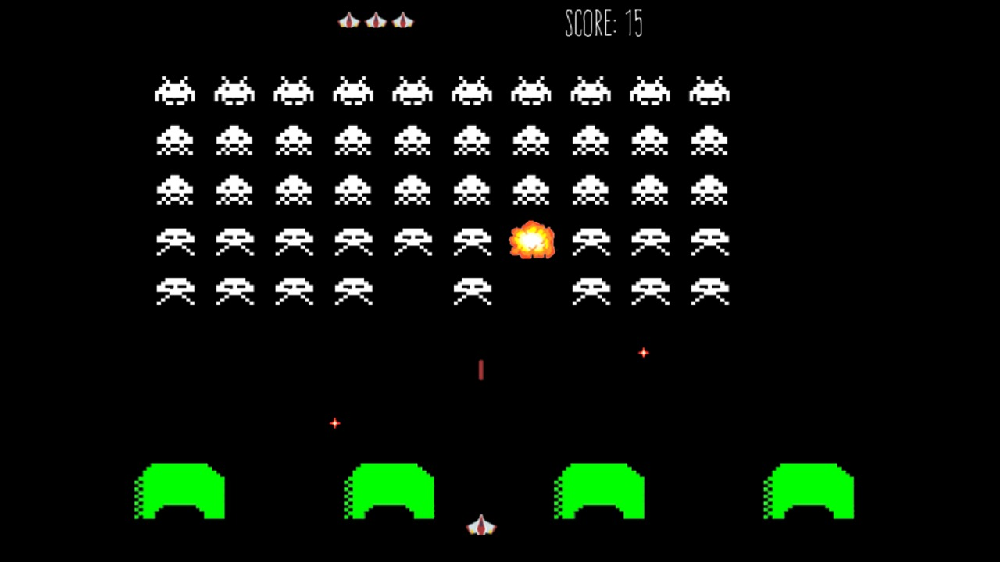

# Galaxy-Defenders

### Galaxy Defenders é um projeto, inspirado no jogo Space Invaders, entregue a disciplina de Técnicas de Programação do Curso de Ciência da Computação.

#### Você pode baixar o jogo [aqui](Galaxy_Defenders_exe.rar). (Versão Windows)

#### Veja algumas [capturas de tela](game-screenshots) do jogo.

 - Linguagem: C.

 - Biblioteca: Allegro 5.

 - Discentes:

     - Olavo Nascimento. (olavo.nascimento4@gmail.com)
      
     - Vitor G.S Ruffo. (vitorruffo19cc@gmail.com)
    
     - Wellinton Piassa. (wellintonpiassa@hotmail.com)
                
                 
 - Docente: Jandira Guenka Palma.

2 de Setembro de 2019, Londrina, Paraná.

Universidade Estadual de Londrina.

### This project is a C game based on Space Invaders, built by Olavo Nascimento, Vitor G. S. Ruffo and Wellinton Piassa. It was made as an assignment for the programming first-year discipline of the State University of Londrina's Computer Science course.

#### You can download the game [here](Galaxy_Defenders_exe.rar). (Windows version)

#### See some nice [screenshots](game-screenshots) of the game.

   - Programming language: C.
 
   - Library: Allegro 5.
 
   - Students:
   
       - Olavo Nascimento. (olavo.nascimento4@gmail.com)
      
       - Vitor G.S Ruffo. (vitorruffo19cc@gmail.com)
    
       - Wellinton Piassa. (wellintonpiassa@hotmail.com)
       
   - Professor: Jandira Guenka Palma.
